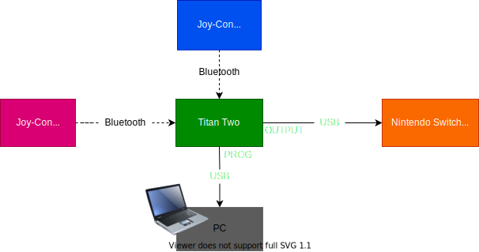

# Ring Fit Mega Man

Instruction to play Mega Man (known as Rockman in Japan) using Ring Fit Adventure controller for exercise

## How to play Mega Man in Ring Fit way

### Version 2 (Recommended)

- Programmed in [ringfit_megaman_squatbuster.gpc](https://github.com/Minyus/RingFit_MegaMan/blob/master/ringfit_megaman_squatbuster.gpc).
- Squat to fire a Mega Buster shot.
- Keep your leg bent to charge a shot (action introduced in Mega Man 4)
- Tilt the Ring-Con to left/right to move.
- Tilt the Ring-Con to backward (lift) to climb up ladders.
- Tilt the Ring-Con to forward (put down) to climb down ladders.
- Press button A (X for Mega Man 7+) to jump. Recommended to hold the Ring-Con at the positions above the grips to press a button.

- Tilt the Ring-Con to forward (put down) and press button A (X for Mega Man 7+) to slide (action introduced in Mega Man 3).

### Version 1 (Alternative)

- Programmed in [ringfit_megaman_squatjump.gpc](https://github.com/Minyus/RingFit_MegaMan/blob/master/ringfit_megaman_squatjump.gpc).
- Squeeze or pull the Ring-Con to fire a Mega Buster shot.
- Tilt the Ring-Con to left/right to move. 
- Tilt the Ring-Con to backward (lift) to climb up ladders.
- Tilt the Ring-Con to forward (put down) to climb down ladders.
- Tilt the Ring-Con to backward (lift) while squatting to jump. You will jump as high as the Ring-Con tilted backward.
- Tilt the Ring-Con to forward (put down) while squatting to slide (action introduced in Mega Man 3).
- [Unsupported] Charge shot (action introduced in Mega Man 4)

## Instruction to set up

### Disclaimer

I shall not be liable for any damage to your body or hardware/software products you use following the instruction below.
The following steps worked for me (after struggling), but I can not guarantee in other cases.

0. Prepare hardware

    - [Nintendo Switch, Dock, and Joy-Cons](https://www.nintendo.com/switch/)
    - [Ring Fit Adventure controller (Ring-Con and leg strap)](https://www.nintendo.com/games/detail/ring-fit-adventure-switch/)

    - [Titan Two](https://www.consoletuner.com/products/titan-two/)
    - [Titan Expansion Kit](https://www.consoletuner.com/products/titan-two/) (to connect Joy-Cons with Titan Two via Bluetooth)

    - PC (Windows 64bit (10, 8.1, 7) or Mac (OS X 10.13+) computer)
    - Additional Micro-USB cable (A Micro-USB cable comes with Titan Two, but you will need one more to connect both PC and 
    Nintendo Switch Dock. I could use an old Micro-USB cable used to charge my old Android smart phone.)

1. Purchase and download Mega Man you like to your Nintendo Switch.
    - [Mega Man Legacy Collection (Mega Man 1-6)](https://www.nintendo.com/games/detail/mega-man-legacy-collection-switch/)
    - [Mega Man Legacy Collection 2 (Mega Man 7-10)](https://www.nintendo.com/games/detail/mega-man-legacy-collection-2-switch/)
    - [Mega Man 11](https://www.nintendo.com/games/detail/mega-man-11-switch/)
    - [Mega Man X Legacy Collection (Mega Man X1-4)](https://www.nintendo.com/games/detail/mega-man-x-legacy-collection-switch/)
    - [Mega Man X Legacy Collection 2 (Mega Man X5-8)](https://www.nintendo.com/games/detail/mega-man-x-legacy-collection-2-switch/)

2. Turn on "Pro Controller Wired Communication" in Nintendo Switch following the [instruction](https://www.nintendo.co.uk/Support/Nintendo-Switch/How-to-Enable-Disable-Nintendo-Switch-Pro-Controller-Wired-Communication-1516284.html) to recognize Titan Two in the later step.

3. Download and Install [Gtuner IV](https://www.consoletuner.com/downloads/?) to your PC (Windows or Mac computer).

4. Install Titan Expansion Kit to Titan Two and connect Titan Two (Micro-USB port labeled "PROG") to your PC following the [instruction](https://www.consoletuner.com/wiki/index.php?id=t2:expansion_kit). [Note] Don't forget [First Time Configuration](https://www.consoletuner.com/wiki/index.php?id=t2:expansion_kit#first_time_configuration)!

5. Sleep Nintendo Switch to avoid the Joy-Cons directly paired up with Nintendo Switch unexpectedly. 

6. Pair up the 2 Joy-Cons (one by one) with Titan Two via Bluetooth following [instruction](https://www.consoletuner.com/wiki/index.php?id=t2:usage_guides:controllers:switch). Pairing Method B using Gtuner IV is recommended. If you choose Pairing Method A, please note that UP button is the button located in the right side of the number LED and labeled (misleading) down-pointing triangle. Once the 2 Joy-Cons are paired up with Titan Two, `Joy-Con Right [IN]` and `Joy-Con Left [IN]` should appear in the "Device Monitor" tab of Gtuner IV's GUI.

7. Download and Install a GPC script ([ringfit_megaman_squatbuster.gpc](https://github.com/Minyus/RingFit_MegaMan/blob/master/ringfit_megaman_squatbuster.gpc) or [ringfit_megaman_squatjump.gpc](https://github.com/Minyus/RingFit_MegaMan/blob/master/ringfit_megaman_squatjump.gpc)) to a memory slot (e.g. 1) of Titan Two following the [instruction](https://www.consoletuner.com/wiki/index.php?id=t2:gpc_scripting).

8. Connect Titan Two (Micro-USB port labeled "OUTPUT") to your Nintendo Switch Dock (one of the USB ports). Use an additional Micro-USB cable if you have so you can monitor the signals from Joy-Cons in Gtuner IV application's GUI. Otherwise, you need to disconnect the Micro-USB cable that connects Titan Two and PC, which is not recommended.

9. Wake up Nintendo Switch by pressing the power button. 

10. Press the UP button on Titan Two once to activate. Nintendo Switch should recognize Titan Two as a Pro controller connected via USB.

11. Set the number indicated by LED on Titan Two to "0" by pressing the UP button once or more times to use the Joy-Cons with the installed GPC program disabled.

12. Start Mega Man in Nintendo Switch.

13. Install the 2 Joy-Cons to Ring-Con and leg strap, respectively.

14. Set the number indicated by LED on Titan Two to the memory slot number (e.g. 1) by pressing the UP button once or more times to enable the installed GPC program.

15. Enjoy!

## Other games to play with Ring Fit Adventure controller

- [Mario Kart X Ring Fit Adventure](https://www.controllerbend.com/mariokart-ring-fit.html)
- [Animal Crossing X Ring Fit Adventure](https://www.controllerbend.com/animalcrossing_ringfit.html)
- [Zelda: Breath of the Wild X Ring Fit Adventure](https://www.controllerbend.com/ringfitbotw.html)

## References for gpc scripting

- https://www.consoletuner.com/wiki/index.php?id=t2:gpc_language_reference
- https://www.consoletuner.com/wiki/index.php?id=t2:gpc_scripting:examples_1

## Author

Yusuke Minami

Twitter: [@Minyus86](https://twitter.com/Minyus86)
